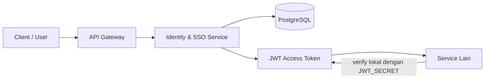

# Identity & SSO Service

Service ini adalah bagian dari **Project-Hub**, sebuah platform berbasis **microservices ecosystem** yang dirancang untuk mendukung kolaborasi proyek antara mahasiswa, mitra, dan panitia dalam satu sistem terintegrasi.

Di dalam ekosistem tersebut, repository ini merepresentasikan **Kelompok 1: Identity & SSO**. Perannya adalah menjadi fondasi autentikasi, otorisasi dasar, dan penyedia identitas pengguna untuk service lain di Project-Hub.

> Catatan penting: workspace ini masih berada pada tahap awal / prototipe. Dokumentasi di bawah menjelaskan arah desain yang sedang dibangun, sedangkan implementasi runtime yang terlihat di repo masih minimal.

---

## Narasi Project-Hub

Project-Hub dikembangkan sebagai simulasi lingkungan perangkat lunak berskala besar, di mana beberapa layanan berdiri sendiri, tetapi tetap saling terhubung melalui API.

Pendekatan yang dipakai adalah **service isolation**:

- setiap kelompok memiliki service dan database masing-masing,
- tidak ada direct access antar database service,
- komunikasi dilakukan melalui **API Gateway** dan mekanisme service-to-service yang tervalidasi,
- interaksi dapat memakai komunikasi sinkron berbasis REST maupun skenario asynchronous seperti message broker.

Secara fungsional, platform ini akan mencakup domain berikut:

- autentikasi dan identitas pengguna,
- manajemen proyek berbasis bidding,
- pembentukan tim,
- monitoring progres,
- notifikasi dan otomasi.

Repo ini berfokus pada domain pertama: **Identity & SSO**.

---

## Arsitektur Singkat



Alur ini menegaskan prinsip utama Project-Hub:

- user masuk melalui Identity & SSO,
- token dipakai oleh service lain tanpa harus selalu memanggil auth service,
- data identitas tetap berada di domain milik Kelompok 1.

---

## Peran Kelompok 1

Kelompok 1 berperan sebagai **gatekeeper** sekaligus **source of truth** untuk identitas pengguna di ekosistem Project-Hub.

Layanan ini dirancang untuk:

- mengautentikasi user yang masuk ke sistem,
- mengelola profil dasar pengguna,
- menyediakan JWT access token untuk dipakai service lain,
- menyimpan dan memvalidasi refresh token,
- menjadi referensi identitas untuk role seperti mahasiswa, mitra, dan panitia.

Di level arsitektur, service ini memakai pendekatan **Layered Architecture / N-Tier** agar tanggung jawabnya terpisah jelas antara:

- layer presentasi / routes,
- layer logika bisnis / controllers,
- layer akses data / models,
- layer middleware untuk autentikasi dan validasi.

---

## Tech Stack

Repo ini disiapkan dengan stack berikut:

- **Runtime**: Node.js 20+
- **Framework**: Express 5
- **Language**: TypeScript
- **Database**: PostgreSQL
- **ORM / database client**: Prisma
- **Auth**: JSON Web Token (JWT)
- **Password hashing**: bcrypt
- **Security middleware**: Helmet, CORS
- **Request logging**: Morgan
- **Containerization**: Docker dan Docker Compose

### Catatan implementasi saat ini

- `src/index.ts` saat ini baru menyalakan server Express sederhana.
- `src/app.ts` masih kosong.
- `README.md` ini mengikuti arah desain yang dituju, bukan hanya kondisi runtime minimal yang ada sekarang.

---

## Struktur Repo

Struktur yang terlihat di workspace saat ini:

- `src/index.ts` - entry point server saat ini
- `src/app.ts` - placeholder untuk konfigurasi aplikasi utama
- `docker-compose.yml` - orkestrasi PostgreSQL dan service lokal
- `docker/init-databases.sh` - inisialisasi database PostgreSQL
- `INTEGRATION_GUIDE.md` - panduan integrasi antar service
- `.env.example` - contoh environment variable root
- `.github/workflows/ci.yml` - pipeline CI

---

## Status Implementasi

Bagian ini penting supaya dokumentasi tidak menyesatkan:

- **Sudah ada di repo**: kerangka proyek, stack dependency, docker orchestration, dan dokumen integrasi.
- **Masih dalam desain / draft**: endpoint auth lengkap, model data final, middleware otorisasi, dan internal service API.
- **Mode integrasi saat ini**: mock mode untuk memudahkan service lain melakukan pengujian awal.

Untuk detail mock integration, lihat [INTEGRATION_GUIDE.md](INTEGRATION_GUIDE.md).

---

## Menjalankan Project

### Dengan Docker Compose

1. Buat file `.env` dari contoh:

```bash
copy .env.example .env
```

2. Jalankan service:

```bash
docker compose up --build -d
```

3. Cek container dan log:

```bash
docker compose ps
docker compose logs -f auth-service
```

### Tanpa Docker

Jika ingin menjalankan service langsung dari host, pastikan PostgreSQL tersedia terlebih dahulu.

```bash
npm install
npm run dev
```

---

## Environment Variables

File contoh tersedia di [`.env.example`](.env.example).

Variabel penting yang dipakai:

- `POSTGRES_USER`
- `POSTGRES_PASSWORD`
- `POSTGRES_PORT`
- `AUTH_DB_NAME`
- `JWT_SECRET`
- `NODE_ENV`

---

## Dokumentasi API

Base path yang direncanakan: `/api`

Dokumentasi API di bawah dibagi menjadi tiga kelompok:

- **available / intended**: endpoint yang menjadi kontrak utama service ini,
- **mock**: endpoint yang saat ini disebut di integrasi awal,
- **planned**: endpoint internal yang disiapkan untuk kebutuhan service-to-service.

### 1) Public API

Endpoint ini tidak memerlukan token.

| Method | Endpoint | Status | Deskripsi |
|---|---|---|---|
| POST | `/api/auth/register` | intended | Membuat akun baru untuk user Project-Hub |
| POST | `/api/auth/login` | intended / mock | Login user dan menghasilkan access token serta refresh token |
| POST | `/api/auth/refresh` | intended / mock | Menukar refresh token menjadi access token baru |

### 2) Protected API

Endpoint ini memerlukan header:

```http
Authorization: Bearer <accessToken>
```

| Method | Endpoint | Status | Deskripsi |
|---|---|---|---|
| POST | `/api/auth/logout` | intended | Mengakhiri sesi login dengan menghapus refresh token |
| GET | `/api/auth/profile` | intended | Mengambil profil pengguna yang sedang login |
| PUT | `/api/auth/profile` | intended | Memperbarui profil pengguna yang sedang login |

### 3) Internal API

Endpoint ini dipakai untuk kebutuhan antar service di dalam network Docker atau backend internal.

| Method | Endpoint | Status | Deskripsi |
|---|---|---|---|
| GET | `/internal/users/:id` | planned | Mengambil data user berdasarkan ID |
| POST | `/internal/validate-token` | planned | Validasi token secara internal bila service lain tidak ingin verifikasi lokal |

### 4) Mock Endpoint untuk Integrasi Awal

`INTEGRATION_GUIDE.md` menjelaskan skenario integrasi awal dengan mock users berikut:

- `client@mock.dev`
- `freelancer@mock.dev`
- `admin@mock.dev`

Mock mode ini dipakai agar service lain bisa diuji lebih awal tanpa menunggu implementasi auth penuh selesai.

### 5) Contoh Request / Response

#### POST /api/auth/login

Request:

```json
{
	"email": "client@mock.dev",
	"password": "apa saja"
}
```

Response sukses:

```json
{
	"success": true,
	"message": "Login berhasil",
	"data": {
		"accessToken": "eyJhbGciOi...",
		"refreshToken": "eyJhbGciOi...",
		"user": {
			"id": "uuid-user",
			"email": "client@mock.dev",
			"role": "client"
		}
	},
	"_mock": true
}
```

#### GET /api/auth/profile

Header:

```http
Authorization: Bearer <accessToken>
```

Response sukses:

```json
{
	"success": true,
	"message": "Profil user berhasil diambil",
	"data": {
		"id": "uuid-user",
		"name": "Client Mock",
		"email": "client@mock.dev",
		"role": "client"
	}
}
```

#### GET /internal/users/:id

Response sukses:

```json
{
	"success": true,
	"message": "User ditemukan",
	"data": {
		"id": "uuid-user",
		"name": "John Doe",
		"email": "john@example.com",
		"role": "freelancer",
		"is_active": true
	}
}
```

---

## Konsep Token untuk Service Lain

JWT access token yang dikeluarkan service ini dirancang berisi informasi dasar seperti:

- `id`
- `email`
- `role`

Prinsip yang dianut:

- service lain memverifikasi JWT secara lokal dengan `JWT_SECRET` yang sama,
- service lain tidak perlu memanggil auth service di setiap request,
- jika butuh data user yang lebih lengkap, service lain dapat memakai endpoint internal yang sudah didesain.

---

## Alur Integrasi Singkat

1. User login ke Identity & SSO.
2. Service mengembalikan access token dan refresh token.
3. Client mengirim access token ke service lain lewat header `Authorization`.
4. Service lain memverifikasi token secara lokal.
5. Role pengguna dipakai untuk menentukan hak akses.

Contoh target penggunaannya:

- mahasiswa dapat login dan melihat profil,
- mitra dapat masuk untuk mengelola proyek,
- panitia dapat mengakses fitur administratif yang dibatasi role.

---

## Checklist Dokumentasi

- [x] Narasi Project-Hub dan peran Kelompok 1
- [x] Tech stack repo
- [x] Status implementasi saat ini
- [x] Dokumentasi API public, protected, dan internal
- [x] Referensi ke mock integration
- [ ] OpenAPI / Swagger spec
- [ ] Diagram arsitektur layanan
- [ ] Contoh request/response lengkap untuk tiap endpoint

---

## Referensi Lanjutan

- **[ENDPOINTS.md](ENDPOINTS.md)** ← Inventory lengkap semua endpoint (source of truth untuk documentation engineer)
- **[docs/swagger.yml](docs/swagger.yml)** ← OpenAPI 3.0 specification dalam file bernama Swagger
- **[docs/README.md](docs/README.md)** ← Cara menggunakan Swagger dan documentation tools
- [INTEGRATION_GUIDE.md](INTEGRATION_GUIDE.md)
- [docker-compose.yml](docker-compose.yml)
- [package.json](package.json)
- [src/index.ts](src/index.ts)

## Lisensi

Lihat [LICENSE](LICENSE).
