# Dokumentasi Arsitektur — Identity & SSO Service

Dokumen ini berisi kumpulan diagram arsitektur sederhana untuk **Identity & SSO Service** (Kelompok 1, Project-Hub). Semua diagram menggunakan format **Mermaid** sehingga dapat dirender langsung di GitHub.

---

## Daftar Diagram

| # | Diagram | Deskripsi |
|---|---------|-----------|
| 1 | [C4 System Context](#1-c4-system-context) | Posisi auth-service dalam ekosistem Project-Hub |
| 2 | [C4 Container / Deployment](#2-c4-container--deployment) | Komponen runtime dan port mapping Docker |
| 3 | [Component Diagram](#3-component-diagram-auth-service) | Lapisan internal auth-service (layered architecture) |
| 4 | [Sequence Diagrams](#4-sequence-diagrams) | Alur register, login, refresh, logout, profile get/update |
| 5 | [ERD — Database](#5-erd--database) | Skema tabel `users` dan `refresh_tokens` |
| 6 | [Endpoint Map](#6-endpoint-map) | Peta endpoint publik vs protected |

---

## 1. C4 System Context

> **Apa ini?** Menunjukkan posisi Identity & SSO Service sebagai "gatekeeper" di ekosistem Project-Hub: siapa penggunanya, dan layanan mana saja yang bergantung padanya.

Identity & SSO Service (Kelompok 1) adalah **pintu masuk terpusat** bagi seluruh pengguna Project-Hub. Semua aktor (Mahasiswa, Mitra, Panitia/Dosen) harus melewati auth-service untuk mendapatkan **JWT Access Token**. Layanan lain (Lelang, Matchmaker, Tracker, Communication) memverifikasi token tersebut secara **lokal** menggunakan `JWT_SECRET` yang sama — sehingga tidak perlu memanggil auth-service setiap kali ada request.

**Komponen dalam diagram:**
- 👤 **Aktor**: Mahasiswa, Mitra, Panitia/Dosen, System Admin/DevOps
- 🔐 **Identity & SSO Service**: inti autentikasi dan manajemen profil
- 🌐 **Layanan lain**: Lelang (Kel. 2), Matchmaker (Kel. 3), Tracker (Kel. 4), Communication (Kel. 5)

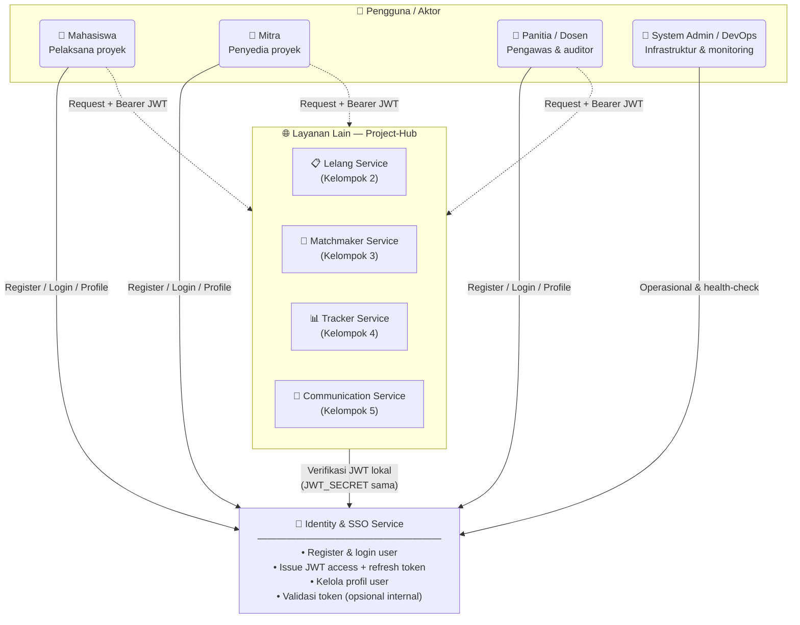

---

## 2. C4 Container / Deployment

> **Apa ini?** Menunjukkan komponen runtime yang berjalan saat menggunakan Docker Compose: client, auth-service (Express), dan PostgreSQL — lengkap dengan port mapping dan jaringan Docker.

Saat dijalankan dengan `docker compose up`, terdapat tiga komponen utama yang saling terhubung dalam jaringan Docker bernama `bidding-network`. Auth-service berjalan di **container port 3000** dan diekspos ke host di **port 3001**. PostgreSQL berjalan di port standar 5432. Tidak ada Redis karena tidak digunakan di kode ini.

**Komponen dalam diagram:**
- 💻 **Client** (browser/aplikasi mobile)
- 🟩 **auth-service** (Express, Node.js 20, container `bidding-auth-service`)
- 🐘 **PostgreSQL 16** (container `bidding-postgres`, database `auth_db`)

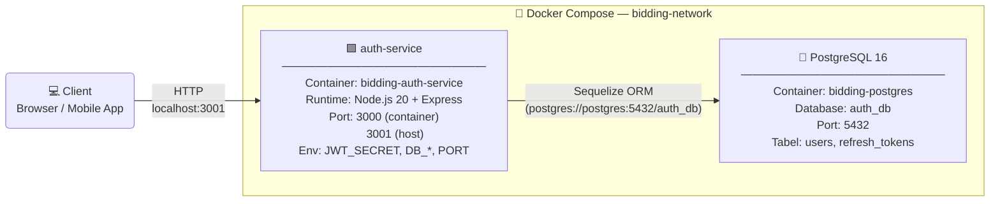

**Port mapping ringkas:**

| Komponen | Port Host | Port Container |
|----------|-----------|----------------|
| auth-service | **3001** | 3000 |
| PostgreSQL | **5432** | 5432 |

---

## 3. Component Diagram (auth-service)

> **Apa ini?** Menunjukkan lapisan-lapisan internal auth-service dan dependensi antar komponennya — dari entry point hingga database.

Auth-service menggunakan **layered (N-tier) architecture**: setiap HTTP request masuk melalui `app.js`, diteruskan ke **Routes** yang mengatur mapping endpoint, kemudian melewati **Middlewares** (validasi, autentikasi), lalu diproses oleh **Controller**. Controller berinteraksi dengan **Models** (Sequelize) untuk operasi database, menggunakan **Utils** untuk operasi JWT, dan membaca konfigurasi dari **Config**.

**Lapisan dan file nyata:**

| Lapisan | File |
|---------|------|
| Entry point | `server.js`, `app.js` |
| Routes | `routes/index.js`, `routes/auth.js` |
| Middlewares | `middlewares/authenticate.js`, `middlewares/authorize.js`, `middlewares/errorHandler.js` |
| Controllers | `controllers/authController.js` |
| Models | `models/User.js`, `models/RefreshToken.js`, `models/index.js` |
| Utils | `utils/jwt.js` |
| Config | `config/index.js`, `config/database.js` |

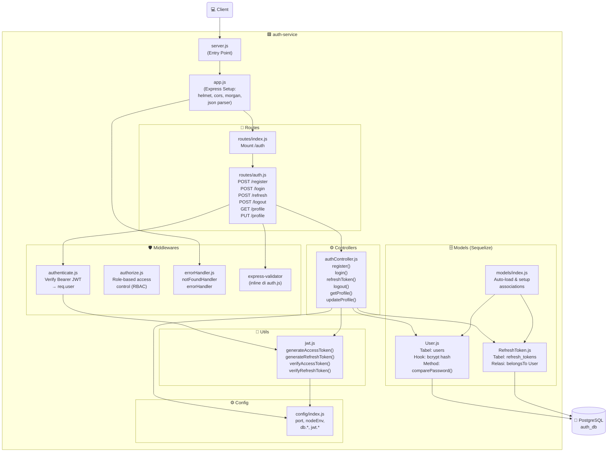

---

## 4. Sequence Diagrams

> **Apa ini?** Menunjukkan alur langkah demi langkah untuk setiap operasi utama — siapa memanggil siapa, dalam urutan apa, dan apa yang dikembalikan.

### 4a. Register

Pengguna mengirimkan data diri, sistem memvalidasi input, mengecek duplikasi email, membuat akun baru (password di-*hash* otomatis via Sequelize hook), dan mengembalikan data user tanpa password.

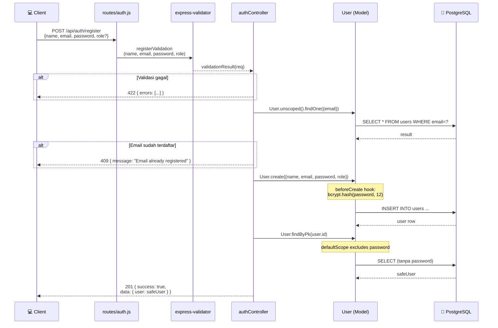

### 4b. Login

Pengguna mengirimkan email dan password. Sistem memverifikasi kredensial, meng-generate JWT access token (berlaku 15 menit) dan refresh token (berlaku 7 hari), lalu menyimpan refresh token ke database.

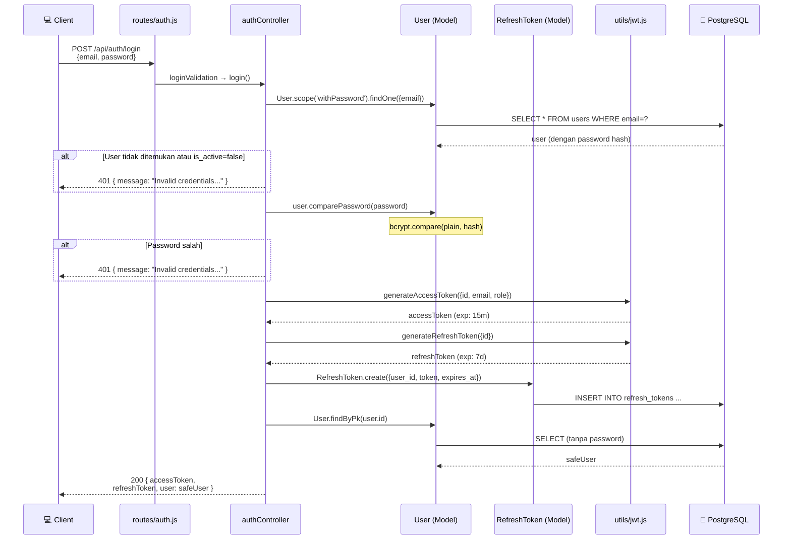

### 4c. Refresh Token

Client mengirimkan refresh token untuk mendapatkan access token baru tanpa harus login ulang. Sistem memverifikasi tanda tangan JWT, mengecek token di database, dan meng-generate access token baru.

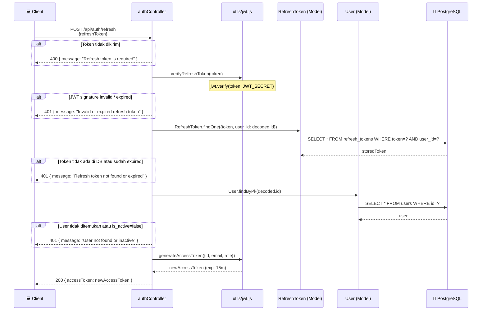

### 4d. Logout

Client mengirimkan access token (di header) dan refresh token (di body). Middleware authenticate memverifikasi access token terlebih dahulu, kemudian controller menghapus refresh token dari database sehingga tidak bisa digunakan lagi.

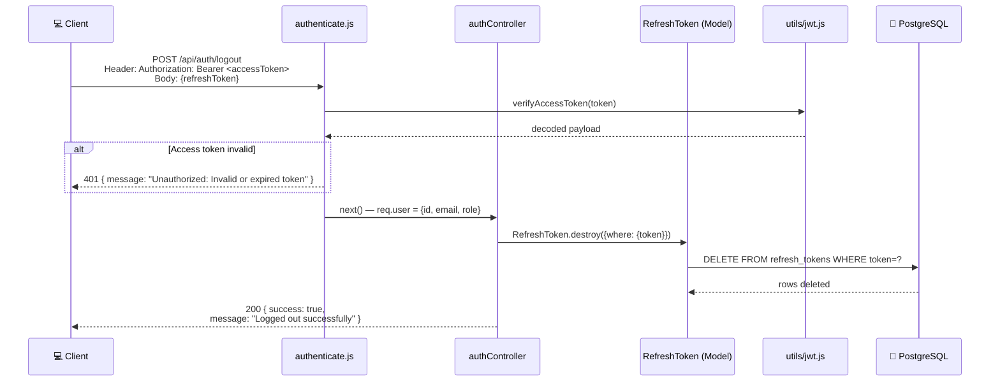

### 4e. Get Profile

Client mengirimkan access token untuk melihat data profilnya sendiri. Middleware authenticate memverifikasi token dan meng-inject `req.user`, lalu controller mengambil data user dari database.

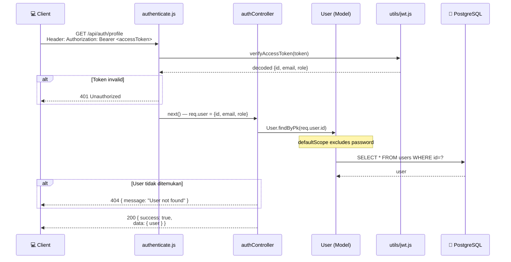

### 4f. Update Profile

Client mengirimkan access token beserta field yang ingin diperbarui (`name` dan/atau `password`). Jika password diubah, Sequelize `beforeUpdate` hook otomatis meng-hash password baru sebelum disimpan.

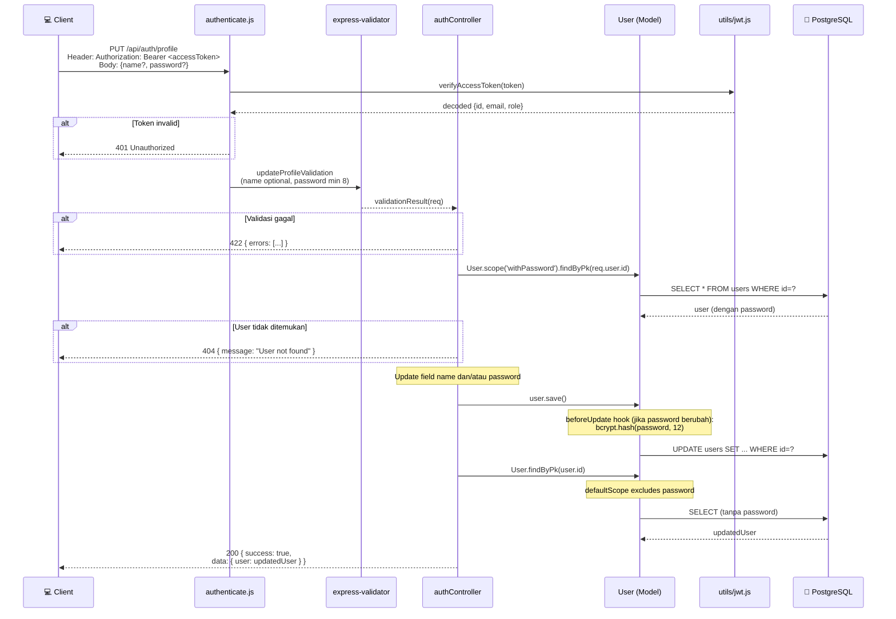

---

## 5. ERD — Database

> **Apa ini?** Menunjukkan skema tabel database yang digunakan auth-service: struktur kolom, tipe data, dan relasi antar tabel.

Database `auth_db` hanya memiliki **dua tabel** yang dikelola Sequelize:
- **`users`**: menyimpan data akun pengguna. Password disimpan dalam bentuk *hash* bcrypt. Kolom `role` menggunakan PostgreSQL ENUM dengan nilai `client`, `freelancer`, atau `admin`.
- **`refresh_tokens`**: menyimpan refresh token yang aktif. Setiap user dapat memiliki banyak refresh token (misalnya login dari beberapa perangkat). Saat user dihapus, semua refresh token-nya ikut terhapus (`ON DELETE CASCADE`).

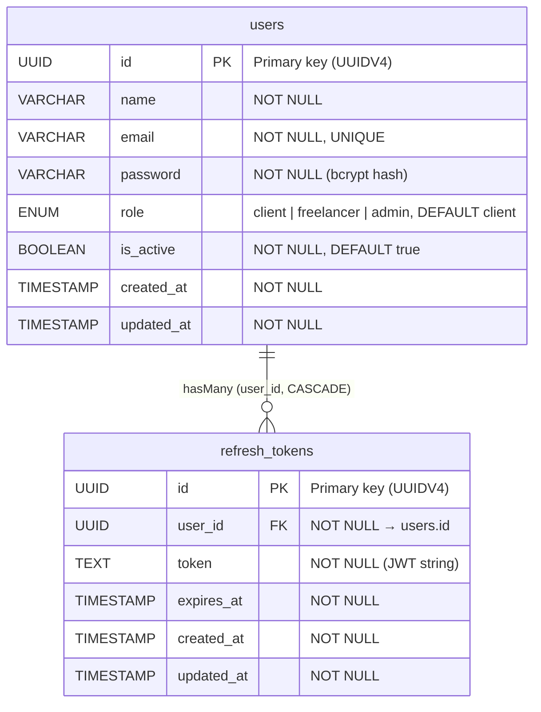

**Relasi:**
- `users` → `refresh_tokens`: **one-to-many** — satu user bisa punya banyak refresh token aktif (multi-device).
- `ON DELETE CASCADE`: jika user dihapus, semua refresh token-nya otomatis ikut terhapus.

---

## 6. Endpoint Map

> **Apa ini?** Peta ringkas semua endpoint yang tersedia di auth-service, dibagi menjadi endpoint **publik** (tanpa token) dan **protected** (butuh Bearer JWT).

Auth-service memiliki **3 endpoint publik** yang tidak memerlukan autentikasi, dan **3 endpoint protected** yang memerlukan `Authorization: Bearer <accessToken>` di header. Selain itu, terdapat 1 endpoint health-check.

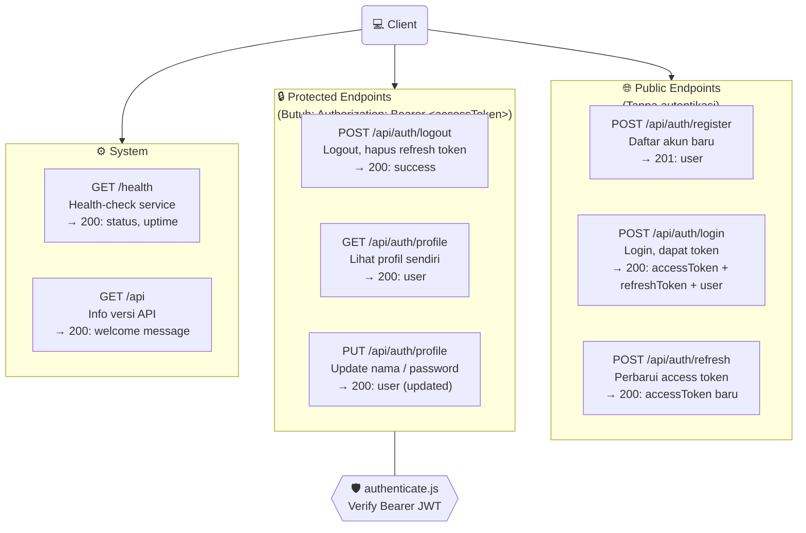

**Ringkasan endpoint:**

| Method | Path | Auth? | Deskripsi |
|--------|------|-------|-----------|
| `POST` | `/api/auth/register` | ❌ | Daftar akun baru |
| `POST` | `/api/auth/login` | ❌ | Login, dapatkan token |
| `POST` | `/api/auth/refresh` | ❌ | Perbarui access token |
| `POST` | `/api/auth/logout` | ✅ Bearer | Logout, hapus refresh token |
| `GET`  | `/api/auth/profile` | ✅ Bearer | Lihat profil sendiri |
| `PUT`  | `/api/auth/profile` | ✅ Bearer | Update profil sendiri |
| `GET`  | `/health` | ❌ | Health-check service |
| `GET`  | `/api` | ❌ | Info versi API |

---

## Referensi

- [README.md](../../README.md) — Dokumentasi utama & cara menjalankan service
- [INTEGRATION_GUIDE.md](../../INTEGRATION_GUIDE.md) — Panduan integrasi untuk service lain
- `services/auth-service/src/` — Source code auth-service
